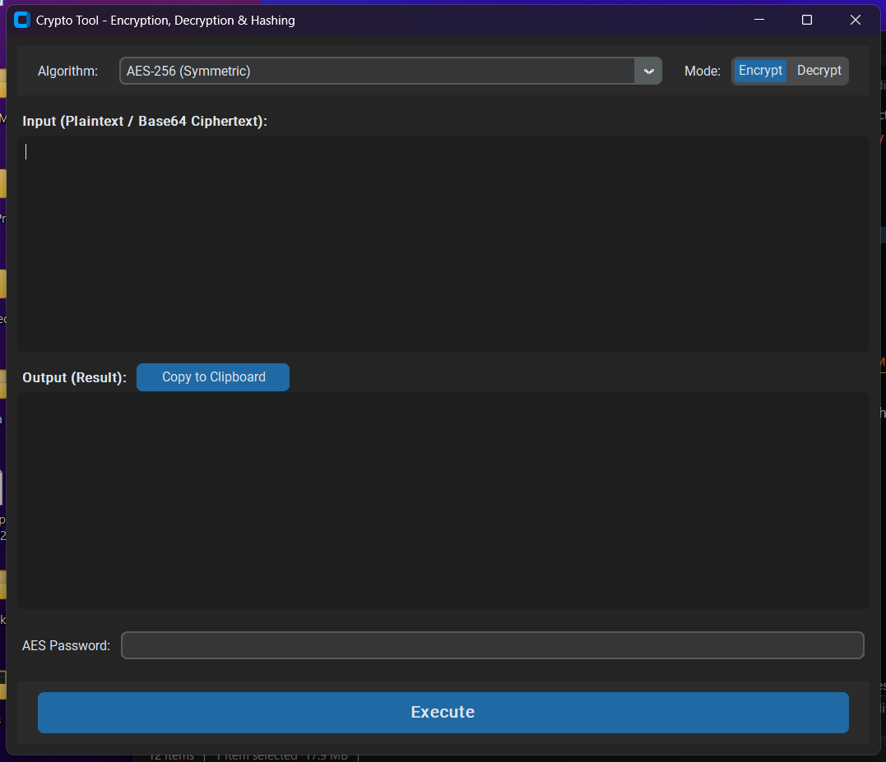
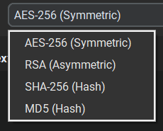

Python GUI application as a tool for encryption and decryption

# Setup and Running
1. Install dependencies
`pip install -r requirements.txt`

2. Run the application
`run app.py`

# Run the application directly
1. Run app.exe
`app.exe`

### Algorithms available

